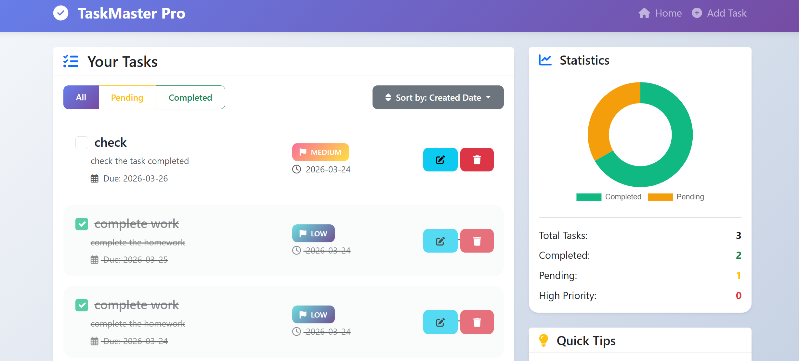

<div align="center">

# 🚀 TaskMaster Pro

### *A Clean and Modern Task Management Web App*


[](https://github.com/Wajiha-Babar/todo_app/stargazers)
[](https://github.com/Wajiha-Babar/todo_app/network)
[](https://github.com/Wajiha-Babar/todo_app/watchers)

> A stylish and user-friendly **To-Do List Application** built with **Python Flask**, designed to help users manage daily tasks efficiently with a simple and productive interface.

</div>

---

## 📌 Overview

**TaskMaster Pro** is a web-based task management application that allows users to organize, track, and manage their daily activities with ease.  
It provides a clean dashboard, smooth interaction, and reliable task storage using **SQLite**.

This project is ideal for learning and demonstrating:

- Flask web development
- CRUD operations
- database integration
- responsive UI design
- task handling in a real-world mini project

---

## 📸 Application Preview

<div align="center">



**TaskMaster Pro Dashboard**

</div>

---

## ✨ Features

- ✅ **Create Tasks** quickly and easily
- 📝 **Update Tasks** whenever changes are needed
- ❌ **Delete Tasks** with a single action
- 📋 **View All Tasks** in an organized layout
- 💾 **SQLite Database Integration** for persistent storage
- 🌐 **Flask Backend** for smooth web functionality
- 🎨 **Responsive Bootstrap Interface** for a clean and modern look
- ⚡ **Simple and Fast Workflow** for better productivity

---

## 🛠️ Tech Stack

| Technology | Purpose |
|-----------|---------|
| **Python** | Core programming language |
| **Flask** | Backend web framework |
| **SQLite** | Database for storing tasks |
| **HTML5** | Structure of web pages |
| **CSS3** | Styling and layout |
| **Bootstrap 5** | Responsive and modern UI |

---

## 📂 Project Structure

```bash
todo_app/
│── app.py
│── taskMaster.png
│── requirements.txt
│── README.md
│── templates/
│   └── index.html
│── static/
│   └── style.css
│── instance/
│   └── database.db
```

---

## 🚀 Installation & Setup

### 1) Clone the repository

```bash
git clone https://github.com/Wajiha-Babar/todo_app.git
cd todo_app
```

### 2) Create a virtual environment

```bash
python -m venv venv
```

### 3) Activate the virtual environment

#### On Windows
```bash
venv\Scripts\activate
```

#### On Mac/Linux
```bash
source venv/bin/activate
```

### 4) Install dependencies

```bash
pip install -r requirements.txt
```

### 5) Run the Flask application

```bash
python app.py
```

### 6) Open in browser

```bash
http://127.0.0.1:5000
```

---

## 📋 How It Works

1. Open the application in your browser  
2. Add a new task  
3. View all saved tasks on the dashboard  
4. Edit tasks when needed  
5. Delete completed or unnecessary tasks  

---

## 🎯 Learning Outcomes

Through this project, I practiced and improved my skills in:

- Flask application development
- CRUD functionality implementation
- database connection and task storage
- frontend and backend integration
- building responsive web interfaces

---

## 🌟 Future Improvements

Some features that can be added in future versions:

- Task priority levels
- Due date and deadline tracking
- Search and filter options
- User authentication
- Dark mode UI
- Task completion status

---

## 🤝 Contributing

Contributions, suggestions, and improvements are always welcome.

If you would like to contribute:

1. Fork the repository  
2. Create a new branch  
3. Make your changes  
4. Commit and push  
5. Open a pull request  

---

## 📄 License

This project is licensed under the **MIT License**.

---

## 👩‍💻 Author

**Wajiha Babar**  
Software Engineering Student | Python & Flask Developer | Aspiring Full-Stack Developer

- GitHub: [Wajiha-Babar](https://github.com/Wajiha-Babar)
- LinkedIn: [wajiha-babar-12731a2bb](https://www.linkedin.com/in/wajiha-babar-12731a2bb/)

---

<div align="center">

### ⭐ If you like this project, don’t forget to star the repository!

</div>